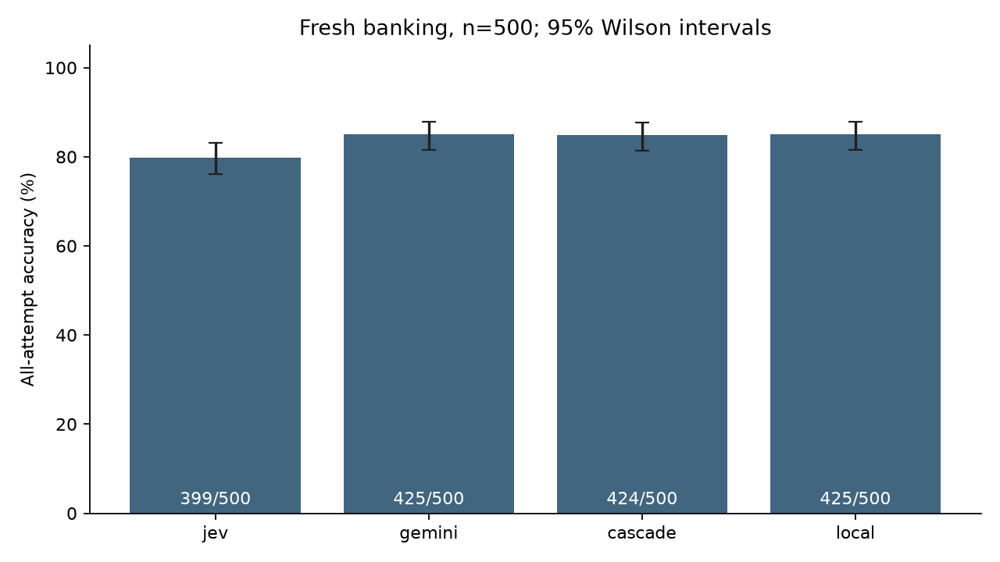
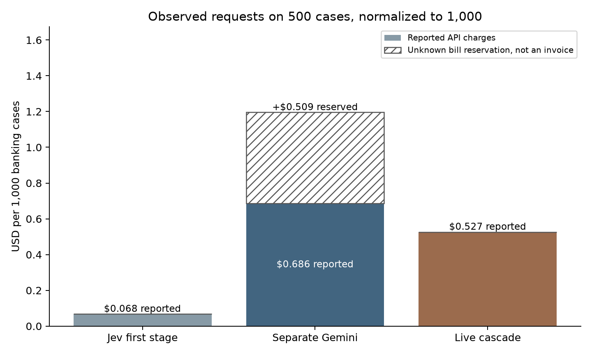
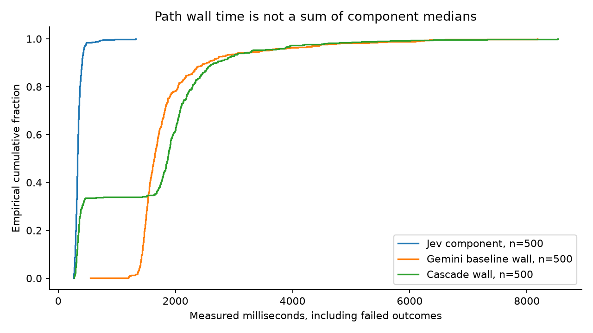
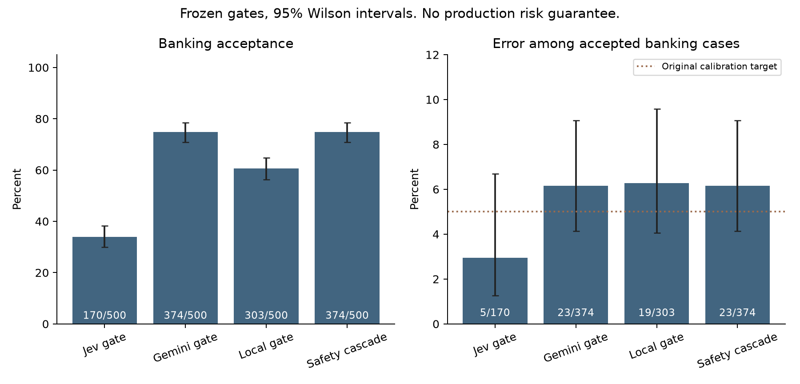
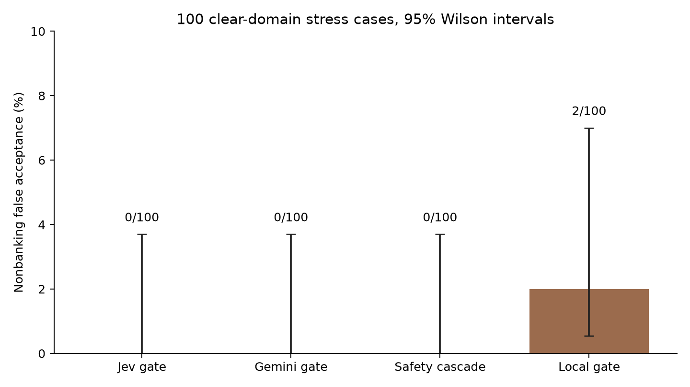

# Fresh Jev to Gemini validation: cheaper requests, slower median, no accuracy gain

Completed September 22, 2026. This is a new prospective experiment, not the earlier post-hoc replay. It uses 500 previously unused BANKING77 test messages and 100 licensed, clearly nonbanking messages. Both live paths completed for every case, with 1,630 physical API attempts.

**The cost saving survived fresh evaluation. The accuracy improvement did not.** The live cascade scored 424/500, versus 425/500 for a separate Gemini-only baseline. Its median banking latency was 1,867 ms, versus 1,638 ms. The cascade's reported banking charges were 23.3% below the baseline's known charges, even treating one failed baseline request as free.

A fixed TF-IDF plus logistic-regression classifier also scored 425/500. That is a useful warning against assuming this task needs a hosted model. The classifier had labeled training data, so this is not a like-for-like zero-shot comparison.

[Download all API responses](data/responses.jsonl.gz) · [Banking results CSV](data/banking-results.csv) · [OOS results CSV](data/oos-results.csv) · [Data schema](data/README.md) · [Offline reproduction](REPRODUCING.md) · [Audit](AUDIT.md)

## Fresh banking results

Accuracy includes all 500 chosen cases. An API or contract failure counts as incorrect. Intervals below are 95% Wilson intervals.

| System | Correct | Accuracy | Valid-response median | Valid-response p95 | Banking failures |
|---|---:|---:|---:|---:|---:|
| Jev first stage | 399/500 | 79.8%, CI 76.1% to 83.1% | 327 ms | 429 ms | 0 |
| Separate Gemini | 425/500 | 85.0%, CI 81.6% to 87.9% | 1,638 ms | 3,472 ms | 1 |
| Real Jev to Gemini cascade | 424/500 | 84.8%, CI 81.4% to 87.7% | 1,867 ms | 3,303 ms | 0 chosen-response failures |
| Local TF-IDF + logistic regression | 425/500 | 85.0%, CI 81.6% to 87.9% | 0.730 CPU ms | 1.281 CPU ms | 0 |

The hosted timing denominator is 500 valid cases for Jev and the cascade, and 499 for Gemini. Local CPU prediction timing includes vectorization and prediction, but excludes model fitting. It is not a hosted/network latency comparison. Percentiles use the higher observed quantile in the core analysis.

The cascade accepted Jev on 170/500 messages and called Gemini on the other 330. Jev made 5 mistakes among its 170 accepted messages. The accepted path's median was 335 ms; the fallback path's median was 2,045 ms.

Against the separate Gemini baseline, the cascade gained 3 correct answers and lost 4. One gain avoided an HTTP 503 failure in the separate baseline request. The paired accuracy difference was **minus 0.2 percentage points**, with a 95% intent-stratified bootstrap interval from minus 1.2 to plus 0.8 points. This does not establish equivalence or noninferiority.

Compared with Jev alone, the cascade gained 33 cases and lost 8, for a 5.0-point accuracy increase, with a paired interval from 2.8 to 7.2 points. Compared with the local classifier, it gained 50 and lost 51. Equal headline accuracies can hide different errors.

## Cost saving without pretending a reservation is a bill

| Banking path, 500 cases | API-reported charges | Missing bills | Conservative provision for missing bills |
|---|---:|---:|---:|
| Jev first stage | $0.033786690 | 0 | $0 |
| Separate Gemini | $0.343194000 | 1 | $0.254479500 |
| Real cascade | $0.263318940 | 0 | $0 |

The Gemini-only HTTP 503 response did not report a charge. Its reservation remains in the budget ledger, but **$0.254479500 is not a known invoice**. Reservations are deliberately large because they cover the endpoint's completion ceiling, not an expected tiny classification answer.

Assigning that failed baseline call a zero bill still leaves a **23.27% banking request-cost reduction** for the cascade. Varying its unknown bill between zero and its reservation produces savings between 23.27% and 55.94%. This is an accounting sensitivity scenario, not a confidence interval. The conservative ledger's 55.94% figure must not be presented as an observed invoice saving.

Jev-only and cascade cost summaries share the same first-stage calls. They must not be added together. These costs describe the 500 banking cases; the whole experiment also paid for the separate comparison path and the OOS stress cases.

## The median became slower

The real cascade's median was about 229 ms, or 14.0%, slower than the separate Gemini path. Its observed p95 was slightly lower in this execution window. Neither observation establishes a general latency advantage.

Each cascade duration surrounds actual serial execution, including routing and durable component journaling. It is not a sum of offline component medians. The separate baseline also has a measured path duration. Cases ran serially, with a seeded, frozen order of the two paths inside each case and no hidden retries. The full latency distribution includes the failed baseline outcome.

## Frozen gates and nonbanking requests

The gates were not tuned on fresh test results. Jev uses native confidence at least 1.0. Gemini uses its verbalized correctness probability at least 0.95. The local classifier's 0.25 cutoff came from the original 200-example calibration split under the same minimum-30 and maximum-5%-empirical-error rule.

| Policy | Accepted banking cases | Mistakes among accepted | Accepted error |
|---|---:|---:|---:|
| Jev native gate | 170/500 | 5/170 | 2.94% |
| Separate Gemini gate | 374/500 | 23/374 | 6.15% |
| Local classifier gate | 303/500 | 19/303 | 6.27% |
| Safety cascade | 374/500 | 23/374 | 6.15% |

The safety cascade accepts a valid Jev answer at its gate. Otherwise it calls Gemini on the original request, accepts only if that response passes the Gemini gate, and defers to a human otherwise. It deferred 126/500 banking cases. Its 23/374 accepted-error interval is 4.13% to 9.06%, so the original 5% calibration target is not a production guarantee. Matching aggregate counts do not mean the standalone and cascade policies are identical.

For the OOS check, we selected ten original CLINC test messages from each of ten nonbanking categories: weather, recipes, playing music, song identification, next song, cooking time, ingredient substitution, nutrition, jokes and smart-home control. We did not use CLINC's mixed native OOS split or generate new gold labels.

| Policy | Nonbanking messages incorrectly accepted as banking |
|---|---:|
| Jev native gate | 0/100 |
| Separate Gemini gate | 0/100 |
| Safety cascade | 0/100 |
| Local classifier gate | 2/100 |

Zero observed false accepts has a 95% Wilson upper bound of about 3.7%, not zero population risk. Jev produced 98 valid responses and two SDK-rejected responses on these 100 messages; failures were deferred. The safety cascade's actual Gemini fallbacks were valid and it deferred all 100 cases to a human.

The **ungated cascade cannot reject OOS input**. It still returns one of 77 banking labels. The human-deferral policy is a separate decision rule, not a claim that forced-answer classification became OOS-aware. This deliberately easy-domain stress test does not cover ambiguous financial near-misses, adversarial instructions or real customer traffic.

## Confidence ranking, not probability calibration

Using only valid, finite-scored banking responses, error-detection AUROC was 0.855 for Jev native confidence, 0.825 for Gemini verbalized confidence and 0.808 for the local maximum-class probability. These are ranking statistics, not interchangeable calibrated correctness probabilities. The [full uncertainty results](supplement/uncertainty.json) include bootstrap intervals, average precision and accepted counts.

Point estimates and bootstrap intervals use the same eligibility mask. Gemini's failed request is absent from both. Matched random-deferral comparators sample only from the same eligible population and defer failures too. No calibration model or new cutoff was fitted to the fresh test set.

## What actually ran

The [frozen protocol](protocol.json) selected 500 official English BANKING77 test examples, stratified over all 77 intents, with six or seven per intent. It excluded all prior study texts and normalized duplicates using Unicode NFKC, case folding and whitespace collapse. Source IDs, exclusions, revision hashes and the sampling algorithm are in [provenance](provenance/sampling.json).

The data/classifier protocol froze at 05:29 UTC. The final hosted-run contract froze and was [published before inference](https://github.com/MohtashamMurshid/jev-speed-test/commit/546934b). Paid requests began at 05:39 UTC and finished at 06:17 UTC, before the 09:15 UTC request cutoff.

The model request settings preserve the original instructions, ordered category mapping, structured schema, reasoning settings and thresholds:

- Jev `typesafe/jev-1.13`, pinned to TypeSafe `typesafe`. Responses identified `typesafe/jev-1.13-20260917`. Native confidence comes from the original provider body, not an SDK-derived substitute.
- Gemini `google/gemini-3.8-flash`, pinned to standard Google AI Studio `google-ai-studio`, low reasoning, temperature zero, 1,024 maximum output tokens. Flex and priority were excluded. Endpoint metadata named the dated September 2 build, but actual successful responses returned the undated alias and service tier `default`. This does not prove an immutable underlying Gemini build.
- Fixed SDK dependencies are [AI SDK 7.0.107](https://www.npmjs.com/package/ai/v/7.0.107), [OpenRouter provider 3.1.0](https://www.npmjs.com/package/@openrouter/ai-sdk-provider/v/3.1.0), and the repository lockfile. Public metadata checks and mock-transport tests made no paid inference calls.

The local classifier fitted word unigram/bigram TF-IDF and L2 multinomial logistic regression with fixed C=1 on 9,742 retained training messages. It excluded the original development and calibration examples, all normalized official-test overlaps and duplicate training texts. It fitted the vectorizer only on training text, used one CPU thread, and did no grid search. Training took about 9.16 CPU seconds. The separate calibration set accepted 127/200 examples at the chosen cutoff, with 5 errors. [Training provenance and configuration](local/training-provenance.json).

## Failures and budget

All 1,200 planned live paths completed. Three component requests failed service or response validation:

- One Gemini-only banking request, `test-861`, returned HTTP 503. Its bill is unknown. The cascade answered this case correctly through its own independently executed path.
- Two Jev OOS responses, `clinc-test-1658` and `clinc-test-2146`, selected an option that was not a highest-probability option. The installed SDK rejected them. [Offline replay](failure-replay.json) reproduced both errors from saved provider bodies, with no network calls. Their reported bills remain included. We did not weaken validation or repair their predictions after the fact.

New API-reported charges total **$0.793283526**. Including the **$0.254479500** unknown-bill provision gives **$1.047763026** conservatively accounted for this follow-up. Adding the original study's $1.028709 accounted amount gives **$2.076472026**, below the $10 combined ceiling and the $8.90 new-inference cap.

Zero API charges for the local classifier do not mean zero compute cost. Host compute was not priced. No additional paid development, warmup, repeat or audit requests were made.

## Audit, reproduction and limits

[Independent reconstruction](independent-audit.json) recalculates predictions from provider bodies, rejoins source labels, verifies routing, checks every physical call is used once, and reconciles charges with decimal arithmetic. Accuracy and Wilson intervals also match scikit-learn and SciPy in the [library cross-check](library-crosscheck.json).

A [fresh-directory replay](offline-reproduction.json) ran with socket connections disabled. It rebuilt the analysis, figures and convenient exports byte for byte. A separate local refit reproduced all 800 calibration, banking and OOS predictions and probabilities exactly, with the same frozen cutoff. Original timing measurements were not replaced by replay timings. All original run-v1 artifacts and the earlier release remain unchanged.

This is still a small public-benchmark experiment on one host and execution window. Fresh means unused by this study, not absent from model training. Exact deduplication does not remove paraphrases; original labels can be ambiguous. The paired bootstrap intervals are exploratory. We did not establish a production risk bound, noninferiority, open-world OOS detection or a universal model ranking.

My practical conclusion is to consider this cascade when avoiding some Gemini requests matters more than median latency, and to keep human deferral explicit. For this narrow, labeled intent task, the simple supervised classifier deserves consideration before either hosted approach. The fresh data do not support selling the cascade as more accurate or categorically faster.

## Sources and licensing

- Casanueva et al., [Efficient Intent Detection with Dual Sentence Encoders](https://arxiv.org/abs/2003.04807), 2020. [BANKING77 source](https://github.com/PolyAI-LDN/task-specific-datasets), CC BY 4.0.
- Larson et al., [An Evaluation Dataset for Intent Classification and Out-of-Scope Prediction](https://aclanthology.org/D19-1131/), 2019. [CLINC source](https://github.com/clinc/oos-eval), CC BY 3.0.
- [Full attribution, pinned revisions and original licenses](provenance/ATTRIBUTION.md), [endpoint snapshot](manifest.json), [pre-inference hashes](pre-inference-freeze.json), [exact runner](runner.ts).

Source text is unchanged; subset metadata and measured evaluation fields were added. No separate software license is implied by public visibility. No portfolio files or deployment were changed.
