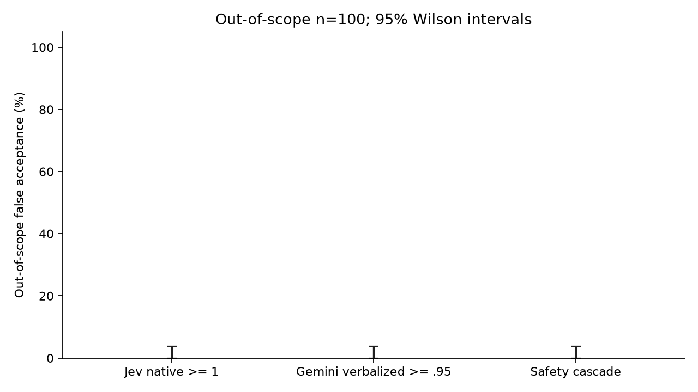

# Fresh follow-up results

Fresh paired evaluation. Failures count as incorrect in every primary accuracy denominator. No threshold was fitted on these results.

| System | Correct / attempted | Accuracy and 95% Wilson CI | Failures | All-outcome median ms | Valid-only median ms |
|---|---:|---:|---:|---:|---:|
| jev | 399/500 | 79.8% [76.1%, 83.1%] | 0 | 327.0243639999826 | 327.0243639999826 |
| gemini | 425/500 | 85.0% [81.6%, 87.9%] | 1 | 1638.047122500022 | 1638.1069819999393 |
| cascade | 424/500 | 84.8% [81.4%, 87.7%] | 0 | 1866.7892324999557 | 1866.7892324999557 |
| local | 425/500 | 85.0% [81.6%, 87.9%] | 0 | 0.730067 | 0.730067 |

## Paired differences

Intervals use paired intent-stratified percentile bootstrap resampling, seed 20260922. Nonsignificance does not establish equivalence.
- cascade_minus_jev: +5.00 percentage points, 95% CI [2.8000000000000003, 7.199999999999999]; gains 33, losses 8. Gains against failed baseline calls: 0.
- cascade_minus_gemini: -0.20 percentage points, 95% CI [-1.2, 0.8]; gains 3, losses 4. Gains against failed baseline calls: 1.
- cascade_minus_local: -0.20 percentage points, 95% CI [-3.5999999999999996, 3.2]; gains 50, losses 51. Gains against failed baseline calls: 0.

## Accounting

Billed amounts, token estimates and request reservations are separate fields. Source totals overlap and must not be added. Accounted totals select bill, otherwise estimate, otherwise reservation per call. Missing amounts remain unknown. Shared Jev calls are not billed again for the Jev-only comparison.

```json
{
  "calls": 1630,
  "source_totals_usd_not_additive": {
    "billedCostUsd": 0.7932835259999992,
    "estimatedCostUsd": 0.0,
    "reservedUsd": 262.26483966600017
  },
  "source_observed_counts": {
    "billedCostUsd": 1629,
    "estimatedCostUsd": 0,
    "reservedUsd": 1630
  },
  "accounted_basis_counts": {
    "billedCostUsd": 1629,
    "estimatedCostUsd": 0,
    "reservedUsd": 1
  },
  "missing_bill_calls": 1,
  "unknown_calls": 0,
  "unknown_calls_definition": "No bill, estimate or reservation available; distinct from missing_bill_calls.",
  "accounted_known_subtotal_usd": 1.0477630259999982,
  "accounted_total_usd": 1.0477630259999982
}
```

| Banking system | Accounted USD | Billed subtotal USD | Estimated subtotal USD | Reserved subtotal USD |
|---|---:|---:|---:|---:|
| jev | 0.03378669000000006 | 0.03378669000000006 | 0.0 | 0.22759573200000022 |
| gemini | 0.5976735000000005 | 0.34319400000000017 | 0.0 | 127.18195950000003 |
| cascade | 0.26331894000000045 | 0.26331894000000045 | 0.0 | 84.16783423199993 |

## Out-of-scope safety

The forced-answer cascade cannot reject out-of-scope input. The separate safety policy accepts valid Jev native confidence >= 1, otherwise accepts the actual fallback Gemini call only when its verbalized probability >= .95; otherwise it defers to a human. Native confidence is not a calibrated correctness probability. The standalone Gemini gate uses its separate matched call.

```json
{
  "jev_accept_false_acceptance": {
    "count": 0,
    "n": 100,
    "rate": 0.0,
    "wilson_ci95": [
      3.469446951953614e-18,
      0.03699349820698568
    ]
  },
  "gemini_baseline_accept_false_acceptance": {
    "count": 0,
    "n": 100,
    "rate": 0.0,
    "wilson_ci95": [
      3.469446951953614e-18,
      0.03699349820698568
    ]
  },
  "safety_accept_false_acceptance": {
    "count": 0,
    "n": 100,
    "rate": 0.0,
    "wilson_ci95": [
      3.469446951953614e-18,
      0.03699349820698568
    ]
  },
  "human_defer": {
    "count": 100,
    "n": 100,
    "rate": 1.0,
    "wilson_ci95": [
      0.9630065017930143,
      1.0
    ]
  }
}
```

Banking safety coverage and accepted error:
```json
{
  "accepted": {
    "count": 374,
    "n": 500,
    "rate": 0.748,
    "wilson_ci95": [
      0.7081521755124419,
      0.7840661516186281
    ]
  },
  "accepted_error": {
    "count": 23,
    "n": 374,
    "rate": 0.06149732620320856,
    "wilson_ci95": [
      0.041325058753411914,
      0.09058597868609403
    ]
  },
  "human_defer_count": 126
}
```

## Timing and limitations

- Cascade and Gemini wall times come from measured path records, not sums of isolated call durations. Missing wall times are not imputed.
- Jev-only timing is the observed first-stage API component. Conditional valid-response timing excludes failed chosen answers and is not the all-attempt latency.
- Local CPU inference, if present, is not comparable to hosted network latency. Zero API charges do not mean zero compute cost.
- OOS rejection is a stress check on the frozen non-banking categories, not universal OOS detection.
- Public benchmark contamination and ambiguous labels remain possible. Sampling intervals do not cover dataset shift, model drift, or provider load variation.
- See summary.json for per-route conditional timings, missing observations, cost basis counts, and physical-call accounting.

## Whole-study budget accounting

```json
{
  "original_study_accounted_usd": 1.028709,
  "fresh_runner_conservative_usd": 1.047763026,
  "combined_conservative_usd": 2.0764720260000002,
  "fresh_cap_usd": 8.9,
  "whole_study_cap_usd": 10,
  "basis": "Runner ledger uses billed amount else reservation, not token estimate. Covers every journal in this run; external development spend must be supplied separately."
}
```

## Local baseline provenance

```json
{
  "threshold": {
    "threshold": 0.25,
    "accepted": 127,
    "errors": 5,
    "calibration_n": 200,
    "rule": "Maximize calibration acceptance with >=30 accepted and <=5% empirical error; tie choose lowest cutoff. Null means defer all. No finite-sample risk guarantee.",
    "protocol_sha256": "9d7c352dac0ca1c79d77d8c0cba0e5544ca06a24a64cb18957327fd421dc8b81"
  },
  "config": {
    "vectorizer": {
      "ngram_range": [
        1,
        2
      ],
      "min_df": 1,
      "max_df": 1.0,
      "sublinear_tf": true,
      "lowercase": true,
      "strip_accents": null,
      "norm": "l2",
      "use_idf": true,
      "smooth_idf": true,
      "token_pattern": "(?u)\\b\\w\\w+\\b",
      "max_features": null
    },
    "classifier": {
      "C": 1.0,
      "solver": "lbfgs",
      "max_iter": 1000,
      "tol": 0.0001,
      "class_weight": null,
      "fit_intercept": true,
      "random_state": 20260922
    },
    "threads": 1,
    "tuning": "None; fixed before test predictions",
    "threshold_grid": [
      0.0,
      0.05,
      0.1,
      0.15,
      0.2,
      0.25,
      0.3,
      0.35,
      0.4,
      0.45,
      0.5,
      0.55,
      0.6,
      0.65,
      0.7,
      0.75,
      0.8,
      0.85,
      0.9,
      0.95,
      1.0
    ],
    "threshold_rule": "Maximize calibration acceptance with >=30 accepted and <=5% empirical error; tie choose lowest cutoff. Null means defer all. No finite-sample risk guarantee."
  },
  "training_rows_retained": 9742,
  "training_provenance_sha256": "4de1ac59ee66786c4920cb0c5d6363ef8c23796e9cb348f48a4e66cc2118a4d9",
  "versions": {
    "python": "3.11.15",
    "sklearn": "1.9.1",
    "numpy": "2.4.6",
    "scipy": "1.17.1"
  },
  "timing": "Per-case single-thread vectorization + predict_proba + argmax, process CPU and wall clock; one warmup on training text; training excluded. Not hosted/network latency.",
  "metrics_recomputed": {
    "banking": {
      "accepted": {
        "count": 303,
        "n": 500,
        "rate": 0.606,
        "wilson_ci95": [
          0.5625178093072173,
          0.6478658305149335
        ]
      },
      "accepted_error": {
        "count": 19,
        "n": 303,
        "rate": 0.0627062706270627,
        "wilson_ci95": [
          0.040508052038617376,
          0.09585376484723115
        ]
      },
      "all_case_cpu_timing": {
        "all_outcomes": {
          "n": 500,
          "missing": 0,
          "median_ms": 0.730067,
          "p95_ms": 1.280573
        },
        "valid_chosen_response_only": {
          "n": 500,
          "missing": 0,
          "median_ms": 0.730067,
          "p95_ms": 1.280573
        }
      },
      "all_case_wall_timing": {
        "all_outcomes": {
          "n": 500,
          "missing": 0,
          "median_ms": 0.7337899999999999,
          "p95_ms": 1.28462
        },
        "valid_chosen_response_only": {
          "n": 500,
          "missing": 0,
          "median_ms": 0.7337899999999999,
          "p95_ms": 1.28462
        }
      }
    },
    "oos": {
      "accepted": {
        "count": 2,
        "n": 100,
        "rate": 0.02,
        "wilson_ci95": [
          0.00550196755016235,
          0.07001179072854388
        ]
      },
      "accepted_error": {
        "count": 2,
        "n": 2,
        "rate": 1.0,
        "wilson_ci95": [
          0.34238022750665303,
          1.0
        ]
      },
      "all_case_cpu_timing": {
        "all_outcomes": {
          "n": 100,
          "missing": 0,
          "median_ms": 0.6698415,
          "p95_ms": 0.922513
        },
        "valid_chosen_response_only": {
          "n": 100,
          "missing": 0,
          "median_ms": 0.6698415,
          "p95_ms": 0.922513
        }
      },
      "all_case_wall_timing": {
        "all_outcomes": {
          "n": 100,
          "missing": 0,
          "median_ms": 0.672215,
          "p95_ms": 0.92595
        },
        "valid_chosen_response_only": {
          "n": 100,
          "missing": 0,
          "median_ms": 0.672215,
          "p95_ms": 0.92595
        }
      }
    }
  },
  "compute_cost": "Not priced; zero API charge does not mean zero compute cost."
}
```

## Reproduce

Run `analyze.py --root <fresh-followup> --out <new-directory> --audit` in the NumPy/Matplotlib environment. The audit rerenders to a temporary directory and requires identical bytes for every export. No network calls are made.



